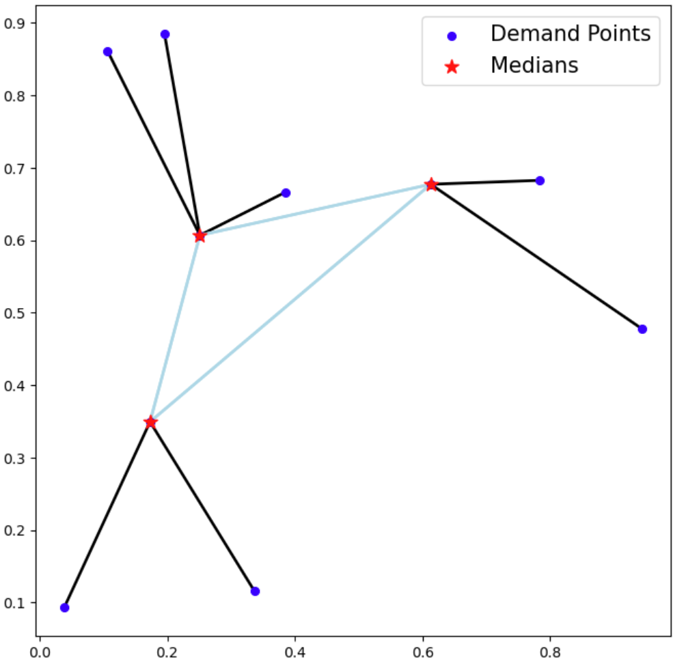

# HiSpot：High Intelligence Spatial Optimization 
Develop HiSpot open-source software to realize mathematical planning solver, approximate algorithm and heuristic algorithm to solve spatial optimization problems.

### Location Routing Problem
LRP jointly considers the facility location problem (FLP) and the vehicle routing problem (VRP)

```python
%% data process
import numpy as np
import random
import geopandas as gpd
region=gpd.read_file("../data/beijing/changping/changping.shp")
poi = gpd.read_file("../data/beijing/changping/changping-poi.shp")

data = poi[['lon', 'lat']]
num_rpoints = poi.shape[0]
rpoints = [(data['lon'][i], data['lat'][i]) for i in range(num_rpoints)]
rpoints_np = np.array(rpoints)
# facility
facilites = [3, 11, 27, 29, 31, 34, 40, 43, 53, 63]
rfacility_nodes_np = rpoints_np[facilites]
rfa_cap = [(random.randint(35, 40), random.randint(40, 45)) for i in range(len(facilites))]
# demand
demands = list(set(range(num_rpoints))-set(facilites))
rdemand_nodes_np = rpoints_np[demands]
rde_demand = [random.randint(1, 10) for i in range(len(demands))]


%% inference
from pulp import *
from hispot.LRP import LRP_cap
rselected, rassigned, robj = LRP_cap(facility_nodes=rfacility_nodes_np,
                        demand_nodes=rdemand_nodes_np,
                        solver=GUROBI_CMD(),
                        fa_cap=rfa_cap,
                        de_demand=rde_demand).prob_solve()

import geoplot as gplt
import geoplot.crs as gcrs
import matplotlib.pyplot as plt
%% prepare the LineString and center Points to plot the solution
from shapely.geometry import LineString
crs = 'EPSG:4326'
lines = gpd.GeoDataFrame(columns=['id', 'geometry'], crs=crs)
k = 0
for i in rassigned:
    center = rfacility_nodes_np[int(i)]
    for j in rassigned[i]:
        assign = rdemand_nodes_np[j]
        line = LineString([center, assign])
        lines.loc[k] = [k+1, line]
        k = k+1
centers=list(np.array(facilites)[rselected])
uncenters=list(set(facilites)-set(centers))
center_points = poi.iloc[centers]
uncenter_points = poi.iloc[uncenters]
%% plot
ax = gplt.sankey(lines,
                 projection=gcrs.Mollweide(),
                 linewidth=1,
                 color='green',
                 zorder=3,
                 figsize=(10, 8),)
gplt.polyplot(region,
              projection=gcrs.AlbersEqualArea(),
              edgecolor="white",
              facecolor="#DBE4C6",
              zorder=1,
              ax=ax,)
gplt.pointplot(poi,
               extent=region.total_bounds,
               s=5,
               color='#3C486B',
               alpha=1,
               linewidth=0,
               label='POI',
               zorder=2,
               ax=ax)
gplt.pointplot(center_points,
               extent=region.total_bounds,
               s=10,
               color='orange',
               alpha=1,
               linewidth=0,
               marker='*',
               label='Served Facility',
               zorder=4,
               ax=ax)
gplt.pointplot(uncenter_points,
               extent=region.total_bounds,
               s=10,
               color='grey',
               alpha=1,
               linewidth=0,
               marker='*',
               label='Unserved Facility',
               zorder=4,
               ax=ax)
plt.legend(loc='upper left')
plt.show()
```

see [notebook](https://github.com/HIGISX/hispot/blob/main/Notebooks/LRP_cap.ipynb) for more code details.

### p-Hub Problem
```python
import random
import numpy as np
%% Generate problem with synthetic data
num_points = 10
num_hubs = 3
PC, PT, PD = 1, 1, 1
# PC, PT, PD = 1.0, 0.75, 1.25
weight = np.random.randint(1, 2, size=(num_points, num_points))
points = [(random.random(), random.random()) for i in range(num_points)]
points_np = np.array(points)

%% inference 
from pulp import *
from hispot.FLP import PHub
hubs, assigns, obj = PHub(num_points=num_points,
                          points=points_np,
                          solver=PULP_CBC_CMD(),
                          num_located=num_hubs,
                          weight=weight,
                          collect_cost=PC,
                          transfer_cost=PT,
                          distribution_cost=PD).prob_solve()
%% plot
import matplotlib.pyplot as plt
plt.figure(figsize=(8,8))
name = 'Problem(P=' + str(num_hubs) + ',I=' + str(num_points) + ') \nThe minimum total cost =' + str(round(obj,4))
plt.title(name, fontsize = 15)

#Points
plt.scatter(*zip(*points_np), c='Blue', marker='o',s=30, label = 'Demand Points', zorder=2)
plt.scatter(*zip(*points_np[hubs]), c='Red', marker='*',s=100,label = 'Medians',zorder=3)
#Lines
for i in assigns:
    center_point = points_np[i]
    for j in assigns[i]:
        demand_points = points_np[j]
        pts = [points[i], points[j]]
        plt.plot(*zip(*pts), c='Black', linewidth=2, zorder=1)
for i in hubs:
    for j in hubs:
        if i != j:
            h = [points[i], points[j]]
            plt.plot(*zip(*h), c='Lightblue', linewidth=2, zorder=1)
# plt.grid(True)   
plt.legend(loc='best', fontsize = 15) 
plt.show()
```

see [notebook](https://github.com/HIGISX/hispot/blob/main/Notebooks/pHub.ipynb) for plotting code and more details.


## Examples
- [p-Median](https://github.com/HIGISX/hispot/blob/main/Notebooks/pMedian.ipynb)
- [p-Center](https://github.com/HIGISX/hispot/blob/main/Notebooks/pCenter.ipynb)
- [P-Dispersion](https://github.com/HIGISX/hispot/blob/main/Notebooks/pDispersion.ipynb)
- [MCLP](https://github.com/HIGISX/hispot/blob/main/Notebooks/MCLP.ipynb)
- [LSCP](https://github.com/HIGISX/hispot/blob/main/Notebooks/LSCP.ipynb)
- [BCLP](https://github.com/HIGISX/hispot/blob/main/Notebooks/BCLP.ipynb)
- [MEXCLP](https://github.com/HIGISX/hispot/blob/main/Notebooks/MEXCLP.ipynb)
- ...


## Running Locally
1. Clone the repo `git clone https://github.com/HIGISX/hispot.git`
2. conda create -n higis python
3. conda activate higis
4. Launch jupyter notebook `jupyter notebook`(pip install jupyter)
5. pip install pulp
6. pip install HiSpot-0.1.0-py3-none-any

You should now be able to run the example notebooks.

You can choose to install and use another solver that is supported by [Pulp](https://github.com/coin-or/pulp):
- [GLPK](https://www.gnu.org/software/glpk/) (included in conda environment)
- [COIN-OR CBC](https://github.com/coin-or/Cbc)
- [CPLEX](https://www.ibm.com/analytics/cplex-optimizer)
- [Gurobi](https://www.gurobi.com/)

## Requirments
-numpy  
-pulp  
-higis(pip install HiSpot-0.1.0-py3-none-any)  

[optional] (for plotting)  
-matplotlib  
-geopandas  
-geoplot

## Installation
pip install higis
pip install numpy
pip install pulp

## Support 
If you are having trouble, please create an issue, start a discussion, or talk to us in the gitter room.


